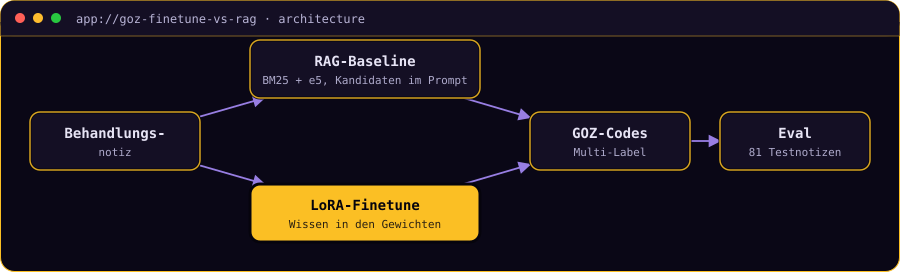

# Medical Coding Extractor

**Extrahiert GOZ-Ziffern aus zahnärztlichen Behandlungsnotizen: LoRA-Finetuning gegen
RAG-Baseline auf identischem Basismodell, plus die gemessene Antwort darauf, warum ein
Graph zwischen beiden nichts bringt.**


[](https://medical-coding-extractor.streamlit.app/)

> **▶ [Demo ausprobieren](https://medical-coding-extractor.streamlit.app/)**
> Zeigt für alle 81 Testnotizen die echten, vorberechneten Ausgaben beider Ansätze neben
> den erwarteten Codes. Vergleiche eine Notiz, bei der die Ansätze auseinanderlaufen.
> *Kein Modell im Speicher; nach längerer Inaktivität zahlt der erste Aufruf einen kurzen
> Kaltstart.*

<!-- TODO(Marco): Screenshot einfuegen, dann diese Zeile durch das Bild ersetzen:
      -->

<details>
<summary><b>🇬🇧 English summary</b></summary>

A LoRA-finetuned Llama-3.2-3B-Instruct extracts German dental billing codes (GOZ) from
treatment notes, benchmarked against a RAG baseline on the same unmodified base model. The
finetune wins on precision and exact match (0.38 vs 0.07). A third approach wired both
paths into a graph with an aggregator, and it changed nothing: the merge rule turned out to
be algebraically identical to the finetune alone. A headroom analysis shows why, and where
the actual leverage is: selecting from the pooled candidates rather than merging sets. Full
write-up in German below.
</details>

---

## In 30 Sekunden

Aus einer Behandlungsnotiz, die mehrere Schritte einer Sitzung beschreiben kann, werden
alle zutreffenden GOZ-Ziffern extrahiert. Das ist eine Multi-Label-Aufgabe über 10
kuratierte Kern-Codes der amtlichen Gebührenordnung.

Die Frage dahinter ist grundsätzlicher: Schlägt Finetuning RAG? Beide Wege bringen
Domänenwissen ins Modell, nur an unterschiedlicher Stelle. Die RAG-Baseline liefert per
BM25 und Embeddings Kandidaten-Codes in den Prompt, das LoRA-Finetune trägt das Wissen in
den Gewichten und braucht zur Inferenzzeit kein Retrieval. Beide laufen auf demselben
unveränderten Llama-3.2-3B-Instruct, damit der Vergleich fair ist. Der trainierte Adapter
liegt öffentlich auf
[Hugging Face](https://huggingface.co/VoidFloat/goz-extract-llama32-3b).

## Die zentrale Entscheidung: der Graph, der nichts gebracht hat

Die Fehlerprofile beider Ansätze sehen komplementär aus, RAG hat den Recall, das Finetune
die Precision. Der naheliegende Schluss ist ein Graph: beide Pfade parallel laufen lassen,
zusammenführen, einen deterministischen Verifier dahinter. Genau das wurde gebaut, mit
einer aus den Fehlerprofilen abgeleiteten Merge-Regel: Codes von beiden Pfaden werden
übernommen, Codes nur vom präziseren Finetune ebenfalls, Codes nur von der RAG-Baseline
gelten als unsicher und werden markiert.

**Das Ergebnis war exakt null Verbesserung.** Und zwar nicht knapp, sondern algebraisch:
„beide" plus „nur Finetune" *ist* die Menge der Finetune-Vorhersagen. Die Regel ist das
Finetune, nur mit einem Prüf-Flag obendrauf, das dann auch noch bei 95 Prozent der Notizen
anschlägt. Lockert man sie, entsteht die Vereinigung beider Pfade, und die ist schlechter
als jeder Einzelpfad. Auch der Verifier lief leer: Über 81 Notizen hat er null Codes
abgelehnt, weil der Prompt den Label-Space ohnehin auf 10 Ziffern begrenzt und keiner der
Pfade je außerhalb davon halluziniert.

Der Code bleibt im Repo, weil die Aussage etwas wert ist: **Graph Engineering ist eine
Verdrahtungsentscheidung, keine Verbesserung an sich.** Was die Kanten transportieren, muss
vorher gemessen werden.

<details>
<summary><b>▸ Deep Dive: die Diagnose, und wo der Hebel wirklich sitzt</b></summary>

`scripts/analyze_merge_headroom.py` rechnet zwei Diagnosezahlen aus den vorhandenen
Exporten nach, ohne GPU:

| Herkunft eines Codes | Precision |
|---|---|
| von beiden Pfaden geliefert | 0.77 |
| nur vom LoRA-Finetune | 0.52 |
| nur von der RAG-Baseline | **0.24** |

Die RAG-Baseline ist kein komplementärer Partner, sie überschießt: 3,01 vorhergesagte Codes
pro Notiz bei 1,67 erwarteten. Ihr Recall-Vorsprung ist erkauft, nicht verdient, und was
sie exklusiv beisteuert, ist zu drei Vierteln falsch.

Entscheidend sind die Obergrenzen. Wer pro Notiz perfekt zwischen den vier fertigen Mengen
wählen könnte (RAG, Finetune, Vereinigung, Schnittmenge), käme auf Exact Match 0.42, also
vier Punkte über dem Finetune. Mengen-Algebra ist damit ausgereizt, egal wie clever die
Regel wird. Die erwarteten Codes stecken aber in 65 von 81 Notizen (0.80) vollständig in
der Vereinigung beider Pfade.

Der Hebel liegt also im **Auswählen, nicht im Verrechnen**. Ein Aggregator, der Mengen
verknüpft, kann diese Lücke prinzipiell nicht schließen. Ein Checker-Node, der die
gepoolten Kandidaten gegen die Notiz prüft und die richtige Teilmenge zieht, hätte Luft von
0.38 in Richtung 0.80.
</details>

<details>
<summary><b>▸ Deep Dive: der Checker-Node, Machbarkeitssonde mit fremdem Modell</b></summary>

Statt Mengen zu verrechnen, behandelt der Checker beide Extraktoren als Retriever: Ihre
Vorschläge werden gepoolt (durchschnittlich 3,68 Kandidaten pro Notiz), und ein Modell
wählt daraus die zutreffende Teilmenge. Strukturell dieselbe Aufgabe wie die RAG-Baseline,
nur mit einem anderen Kandidatenpool.

Die faire Zeile braucht dasselbe Basismodell wie alle anderen und damit eine Colab-GPU, sie
steht noch aus. Vorab klärt eine Sonde mit einem stärkeren API-Modell, ob die
Auswahlaufgabe überhaupt lösbar ist:

| Variante | Precision | Recall | F1 | Exact Match | Prüfquote |
|---|---|---|---|---|---|
| LoRA-Finetune (Referenz) | 0.65 | 0.58 | 0.59 | 0.38 | |
| Graph, Aggregator | 0.65 | 0.58 | 0.59 | 0.38 | 95 % |
| Graph + Checker *(Sonde, anderes Modell)* | 0.88 | 0.86 | 0.86 | **0.74** | 1 % |
| Perfekte Auswahl *(Orakel, kein Modell)* | 0.94 | 0.88 | 0.90 | 0.80 | 6 % |

> Die Sondenzeile ist **kein fairer Vergleich** und gehört nicht in die Ergebnistabelle
> oben: Sie läuft auf einem anderen, deutlich stärkeren Modell. Ihr Zweck ist allein, die
> Machbarkeit zu klären, bevor eine GPU-Sitzung investiert wird.

Aufschlussreich ist die Zerlegung: Von den 65 Notizen, deren erwartete Codes überhaupt im
Pool stecken, trifft der Checker 60, also 92 Prozent. Die übrigen 16 sind für ihn per
Konstruktion unlösbar, denn was kein Extraktor vorgeschlagen hat, kann er nicht auswählen.

Damit verschiebt sich das Problem: Die Auswahl ist weitgehend gelöst, was bleibt, ist ein
Recall-Problem *des Pools*. Der nächste sinnvolle Hebel ist also nicht ein besserer
Selektor, sondern ein Kandidatenpool, der öfter vollständig ist. Nebenbei fällt die
Prüfquote von 95 auf 1 Prozent, der Checker entscheidet statt an einen Menschen abzugeben.
Bemerkenswert auch die Kalibrierung: aus 3,68 Kandidaten wählt er im Schnitt 1,62 Codes,
erwartet werden 1,68.

```bash
python scripts/analyze_merge_headroom.py --results-dir results/                # Diagnose
python scripts/run_graph_eval.py --results-dir results/                        # Aggregator
python scripts/run_checker_eval.py --results-dir results/ --backend oracle     # Obergrenze
```
</details>

<details>
<summary><b>▸ Deep Dive: was beim Training schiefging</b></summary>

Der Weg zu den Zahlen war kein Selbstläufer. Zwei frühe Trainingsläufe kollabierten in
nahezu konstante Vorhersagen, das Modell gab für fast jede Notiz dieselbe Code-Kombination
aus. Systematisches Debugging führte das zunächst auf klassisches Exposure Bias zurück
(gesunde Trainings-Loss-Kurve, aber kollabierende freie Generierung), danach auf die
eigentliche Ursache: schlicht zu wenige Gradientenschritte. Erst nach dieser Korrektur
entstanden die Ergebnisse oben.
</details>

## Architektur



Beide Pfade nutzen dasselbe unveränderte Llama-3.2-3B-Instruct, nur der Weg des
Domänenwissens unterscheidet sich. Genau das macht den Vergleich aussagekräftig.

## Was es kann, und was nicht

Llama-3.2-3B-Instruct, 10 kuratierte GOZ-Kern-Codes, 325 Trainings- und 81 Testnotizen
(synthetisch generiert, siehe `scripts/generate_data.py`):

| Ansatz | Precision | Recall | F1 | Exact Match |
|---|---|---|---|---|
| RAG-Baseline | 0.40 | 0.70 | 0.48 | 0.07 |
| LoRA-Finetune | **0.65** | 0.58 | **0.59** | **0.38** |
| Graph (Merge + Verifier) | 0.65 | 0.58 | 0.59 | 0.38 |

Die RAG-Baseline hat den höheren Recall, weil sie mehr Kandidaten angeboten bekommt und
daher öfter irgendeinen richtigen Code trifft. Das Finetune ist präziser und trifft
deutlich öfter die exakte Kombination. Der Graph bringt nichts, siehe oben.

**Was dieses Projekt nicht ist:** Der Label-Space ist auf 10 Alltags-Codes begrenzt statt
auf die vollen 221 GOZ-Codes, eine bewusste Reduktion, um mit der kleinen synthetischen
Datenmenge genug Beispiele pro Code zu haben. Die Trainingsdaten sind LLM-generiert und
nicht im großen Stil mit realen Praxisfällen abgeglichen. Die RAG-Baseline nutzt eine
vereinfachte Retrieval-Pipeline ohne die Segmentierungs- und Validierungsschritte eines
Produktivsystems. Und die faire Checker-Zeile fehlt noch, sie braucht eine GPU-Sitzung.

**Datenherkunft:** ausschließlich die amtliche GOZ-Codeliste (öffentliche Gebührenordnung,
`data/goz_codes.json`) und komplett selbst generierte synthetische Notizen. Keine realen
Patienten- oder Praxisdaten, kein Material aus Drittsystemen.

## Selbst ausprobieren

Einmalig: `python -m venv .venv`, `.venv/Scripts/python.exe -m pip install -e ".[dev]"` und
`.env` aus [`.env.example`](.env.example) anlegen. Training und Inferenz laufen auf Colab
(`notebooks/train_and_infer.ipynb`, braucht HF-Zustimmung zur Llama-3.2-Lizenz), die lokale
Demo braucht die von dort heruntergeladenen Artefakte unter `adapters/`.

```bash
.venv/Scripts/python.exe -m pytest tests/ -v
python scripts/analyze_merge_headroom.py --results-dir results/   # Diagnose ohne GPU
.venv/Scripts/python.exe -m streamlit run app.py                  # lokale Demo
```

---

```console
marco@portfolio:~$ open marco-os --project goz-finetune-vs-rag
```

**[▸ Dieses Projekt in MARCO.OS öffnen](https://marco-stang.github.io/#goz-finetune-vs-rag)**,
dem interaktiven Portfolio von Marco Stang.

**Schwesterprojekte:**
[SQL Copilot](https://github.com/marco-stang/sql-copilot) (LangGraph-Agent mit Guardrails) ·
[Review Risk Predictor](https://github.com/marco-stang/review-risk-predictor) (erklärbares ML, React/FastAPI) ·
[Ask-Marco Assistant](https://github.com/marco-stang/ask-marco-assistant) (Chat über alle Projekte)

<sub>Marco Stang · Dr.-Ing. · [LinkedIn](https://www.linkedin.com/in/marco-stang) · stang.marco@t-online.de · MIT-Lizenz</sub>
