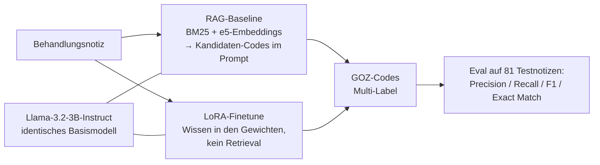

# Medical Coding Extractor

GOZ-Code-Extraktion: LoRA-Finetuning vs. RAG-Baseline.

Portfolio-Projekt: Ein LoRA-feingetuntes Llama-3.2-3B-Instruct extrahiert
GOZ-Ziffern aus zahnärztlichen Behandlungsnotizen — verglichen gegen eine
RAG-Baseline auf demselben, unveränderten Basismodell. Ziel: eine konkrete,
messbare Antwort auf "schlägt Finetuning RAG?".

<!-- TODO(Marco): Screenshot der lokalen Streamlit-Demo hier einfügen:
      -->

Keine gehostete Live-Demo: Training und Inferenz laufen auf Colab (GPU),
die Streamlit-Demo läuft lokal mit den von Colab heruntergeladenen
Adapter-Artefakten — siehe Setup unten.

## Aufgabe

Aus einer Behandlungsnotiz (kann mehrere Behandlungsschritte einer Sitzung
beschreiben) werden alle zutreffenden GOZ-Ziffern extrahiert (Multi-Label),
aus einem Label-Space von 10 Kern-Codes (häufigste Alltagsleistungen aus den
Kategorien "Allgemeine zahnärztliche Leistungen" + "Konservierende
Leistungen" der amtlichen Gebührenordnung, reduziert aus einer ursprünglich
55-Code-Liste - siehe Abschnitt "Limitierungen" unten).

## Zwei Wege, Domänenwissen einzubringen

- **RAG-Baseline:** BM25 + Embeddings (`multilingual-e5-base`) liefern
  Kandidaten-Codes, dasselbe Basismodell wählt daraus per Prompt.
- **LoRA-Finetune:** Domänenwissen steckt in den LoRA-Gewichten, kein
  Retrieval zur Inferenzzeit.



## Ergebnisse

Llama-3.2-3B-Instruct, 10 kuratierte GOZ-Kern-Codes, 325 Trainings- /
81 Testnotizen (synthetisch generiert, siehe `scripts/generate_data.py`):

| Ansatz | Precision | Recall | F1 | Exact Match |
|---|---|---|---|---|
| RAG-Baseline | 0.40 | 0.70 | 0.48 | 0.07 |
| LoRA-Finetune | 0.65 | 0.58 | 0.59 | 0.38 |

Die RAG-Baseline (BM25 + Embedding-Retrieval, Kandidatenliste im Prompt)
hat höheren Recall — sie bekommt mehr Kandidaten angeboten und trifft daher
öfter irgendeinen richtigen Code. Das LoRA-Finetune ist präziser und trifft
deutlich öfter die exakte Code-Kombination, weil das Wissen in den
Modellgewichten steckt statt über Retrieval nachgereicht zu werden.

## Was schiefging (und warum das dazugehört)

Der Weg zu diesen Zahlen war kein Selbstläufer: Zwei frühe Trainingsläufe
kollabierten in nahezu konstante Vorhersagen — das Modell gab für fast
jede Notiz dieselbe Code-Kombination aus. Systematisches Debugging führte
das zunächst auf klassisches Exposure Bias zurück (gesunde
Trainings-Loss-Kurve, aber kollabierende freie Generierung), danach auf
die eigentliche Ursache: schlicht zu wenige Gradientenschritte. Erst nach
dieser Korrektur entstanden die Ergebnisse in der Tabelle oben.

## Setup

```bash
python -m venv .venv
.venv/Scripts/python.exe -m pip install -e ".[dev]"
cp .env.example .env  # ANTHROPIC_API_KEY eintragen
.venv/Scripts/python.exe -m pytest tests/ -v
```

Trainingsdaten generieren und Codeliste kuratieren: siehe
`scripts/curate_codes.py`, `scripts/generate_data.py`,
`scripts/build_dataset.py`.

Training + Inferenz laufen auf Colab: `notebooks/train_and_infer.ipynb`
(braucht HF-Zustimmung zur Llama-3.2-Lizenz).

Demo starten (braucht die von Colab heruntergeladenen Artefakte unter
`adapters/`): `.venv/Scripts/python.exe -m streamlit run app.py`

## Datenherkunft

Nur die amtliche GOZ-Codeliste (öffentliche Gebührenordnung, `data/goz_codes.json`)
und komplett selbst generierte, synthetische Trainings-/Testnotizen
(`scripts/generate_data.py`). Keine realen Patienten-/Praxisdaten, kein
Code oder Trainingsmaterial aus Drittsystemen.

## Limitierungen

- Label-Space auf 10 Alltags-Codes begrenzt (nicht die vollen 221 GOZ-Codes) -
  bewusste Reduktion, um mit der kleinen synthetischen Datenmenge genug
  Beispiele pro Code fürs Finetuning zu haben
- Trainingsdaten sind synthetisch (LLM-generiert), kein Abgleich mit realen
  Praxisfällen im großen Stil
- RAG-Baseline nutzt eine vereinfachte Retrieval-Pipeline ohne die
  Segmentierungs- und Validierungsschritte eines Produktivsystems

## Portfolio-Kontext

Dieses Projekt ist Teil von **[MARCO.OS](https://maggostang-droid.github.io/marco-os/)**,
dem interaktiven Portfolio von Marco Stang. Schwesterprojekte:

- [SQL Copilot](https://github.com/maggostang-droid/sql-copilot) — LangGraph-Agent für Text-to-SQL mit Guardrails und Selbstkorrektur
- [Review Risk Predictor](https://github.com/maggostang-droid/review-risk-predictor) — erklärbare ML-Risikovorhersage (React/FastAPI)
- [Ask-Marco Assistant](https://github.com/maggostang-droid/ask-marco-assistant) — Chat, der alle Portfolio-Projekte kennt (Context-Stuffing + MCP-Server)
