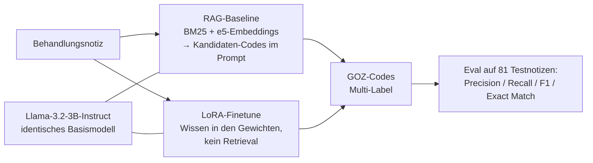
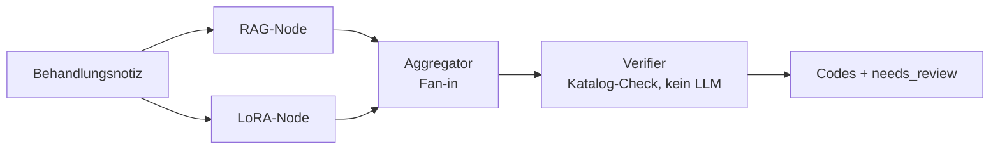

# Medical Coding Extractor

GOZ-Code-Extraktion: LoRA-Finetuning vs. RAG-Baseline vs. Graph.

Portfolio-Projekt: Ein LoRA-feingetuntes Llama-3.2-3B-Instruct extrahiert
GOZ-Ziffern aus zahnärztlichen Behandlungsnotizen — verglichen gegen eine
RAG-Baseline auf demselben, unveränderten Basismodell. Ziel: eine konkrete,
messbare Antwort auf "schlägt Finetuning RAG?".

Dazu kam ein dritter Ansatz: beide Pfade als Graph verdrahtet, mit
deterministischem Verifier. Er hat **nicht** funktioniert — die Messung und
die Obergrenzen-Rechnung, die zeigt warum, stehen weiter unten.

<!-- TODO(Marco): Screenshot der lokalen Streamlit-Demo hier einfügen:
      -->

**▶ [Live-Demo ausprobieren](https://medical-coding-extractor.streamlit.app/)** —
zeigt für alle 81 Testnotizen die echten, vorberechneten Ausgaben beider
Ansätze neben den erwarteten Codes (kein Modell im Speicher; nach längerer
Inaktivität zahlt der erste Aufruf einen kurzen Kaltstart).

Training und Inferenz laufen auf Colab (GPU); eine lokale Streamlit-App
mit echter Live-Inferenz gibt es zusätzlich — siehe Setup unten. Der
trainierte LoRA-Adapter liegt öffentlich auf
[Hugging Face](https://huggingface.co/VoidFloat/goz-extract-llama32-3b).

## Aufgabe

Aus einer Behandlungsnotiz (kann mehrere Behandlungsschritte einer Sitzung
beschreiben) werden alle zutreffenden GOZ-Ziffern extrahiert (Multi-Label),
aus einem Label-Space von 10 Kern-Codes (häufigste Alltagsleistungen aus den
Kategorien "Allgemeine zahnärztliche Leistungen" + "Konservierende
Leistungen" der amtlichen Gebührenordnung, reduziert aus einer ursprünglich
55-Code-Liste - siehe Abschnitt "Limitierungen" unten).

## Zwei Wege, Domänenwissen einzubringen

- **RAG-Baseline:** BM25 + Embeddings (`multilingual-e5-base`) liefern
  Kandidaten-Codes, dasselbe Basismodell wählt daraus per Prompt.
- **LoRA-Finetune:** Domänenwissen steckt in den LoRA-Gewichten, kein
  Retrieval zur Inferenzzeit.



## Ergebnisse

Llama-3.2-3B-Instruct, 10 kuratierte GOZ-Kern-Codes, 325 Trainings- /
81 Testnotizen (synthetisch generiert, siehe `scripts/generate_data.py`):

| Ansatz | Precision | Recall | F1 | Exact Match |
|---|---|---|---|---|
| RAG-Baseline | 0.40 | 0.70 | 0.48 | 0.07 |
| LoRA-Finetune | 0.65 | 0.58 | 0.59 | 0.38 |

Die RAG-Baseline (BM25 + Embedding-Retrieval, Kandidatenliste im Prompt)
hat höheren Recall — sie bekommt mehr Kandidaten angeboten und trifft daher
öfter irgendeinen richtigen Code. Das LoRA-Finetune ist präziser und trifft
deutlich öfter die exakte Code-Kombination, weil das Wissen in den
Modellgewichten steckt statt über Retrieval nachgereicht zu werden.

## Dritter Weg: ein Graph — und warum er hier nicht hält

Die Fehlerprofile oben sehen komplementär aus: RAG hat den Recall, das
Finetune die Precision. Der naheliegende Schluss ist ein Graph — beide
Pfade parallel laufen lassen, die Ergebnisse zusammenführen, einen
deterministischen Verifier dahinter. Genau das habe ich gebaut:



Merge-Regel, aus den Fehlerprofilen abgeleitet: Codes, die beide Pfade
liefern, werden übernommen; Codes nur vom präziseren Finetune ebenfalls;
Codes nur von der RAG-Baseline gelten als unsicher und werden zur Prüfung
markiert statt vorhergesagt.

Das Ergebnis auf demselben Testset:

| Ansatz | Precision | Recall | F1 | Exact Match | Prüfquote |
|---|---|---|---|---|---|
| RAG-Baseline | 0.40 | 0.70 | 0.48 | 0.07 | — |
| LoRA-Finetune | 0.65 | 0.58 | 0.59 | 0.38 | — |
| Graph (Merge + Verifier) | 0.65 | 0.58 | 0.59 | 0.38 | 95% |
| Graph (Merge gelockert) | 0.43 | 0.88 | 0.55 | 0.05 | 0% |

**Der Graph bringt exakt nichts.** Und zwar nicht knapp, sondern
algebraisch: „beide" plus „nur Finetune" ist die Menge der
Finetune-Vorhersagen. Die Regel *ist* das Finetune, nur mit einem
Prüf-Flag on top — das dann auch noch bei 95% der Notizen anschlägt.
Lockert man sie, entsteht die Vereinigung beider Pfade, und die ist
schlechter als jeder Einzelpfad. Auch der Verifier läuft leer: er hat
über 81 Notizen **null** Codes abgelehnt, weil der Prompt den Label-Space
ohnehin auf 10 Ziffern begrenzt und keiner der beiden Pfade je außerhalb
davon halluziniert.

### Woran es liegt — und wo der Hebel wirklich sitzt

Zwei Diagnosezahlen (`scripts/analyze_merge_headroom.py` rechnet sie aus
den vorhandenen Exporten nach, ohne GPU):

| Herkunft eines Codes | Precision |
|---|---|
| von beiden Pfaden geliefert | 0.77 |
| nur vom LoRA-Finetune | 0.52 |
| nur von der RAG-Baseline | **0.24** |

Die RAG-Baseline ist kein komplementärer Partner, sie überschießt: 3,01
vorhergesagte Codes pro Notiz bei 1,67 erwarteten. Ihr Recall-Vorsprung
ist erkauft, nicht verdient — und was sie exklusiv beisteuert, ist zu drei
Vierteln falsch.

Entscheidend sind aber die Obergrenzen:

- Wer pro Notiz **perfekt zwischen den vier fertigen Mengen** wählen
  könnte (RAG, Finetune, Vereinigung, Schnittmenge), käme auf Exact Match
  **0.42** — vier Punkte über dem Finetune. Mengen-Algebra ist damit
  ausgereizt, egal wie clever die Regel wird.
- Die erwarteten Codes stecken aber in **65 von 81 Notizen (0.80)**
  vollständig in der Vereinigung beider Pfade.

Der Hebel liegt also im **Auswählen, nicht im Verrechnen**. Ein
Aggregator, der Mengen verknüpft, kann diese Lücke prinzipiell nicht
schließen; ein Checker-Node, der die gepoolten Kandidaten gegen die Notiz
prüft und die richtige Teilmenge zieht, hätte Luft von 0.38 in Richtung
0.80. Das ist der nächste Ausbauschritt — und ein anderes Graph-Muster
(Maker/Checker statt Fan-out/Fan-in), das wieder Inferenz kostet statt
nur Mengenlehre.

Der Code bleibt im Repo, weil die Aussage etwas wert ist: Graph
Engineering ist eine Verdrahtungsentscheidung, keine Verbesserung an
sich. Was die Kanten transportieren, muss vorher gemessen werden.

```bash
python scripts/analyze_merge_headroom.py --results-dir results/   # Diagnose
python scripts/run_graph_eval.py --results-dir results/           # Graph-Zeile
```

## Was schiefging (und warum das dazugehört)

Der Weg zu diesen Zahlen war kein Selbstläufer: Zwei frühe Trainingsläufe
kollabierten in nahezu konstante Vorhersagen — das Modell gab für fast
jede Notiz dieselbe Code-Kombination aus. Systematisches Debugging führte
das zunächst auf klassisches Exposure Bias zurück (gesunde
Trainings-Loss-Kurve, aber kollabierende freie Generierung), danach auf
die eigentliche Ursache: schlicht zu wenige Gradientenschritte. Erst nach
dieser Korrektur entstanden die Ergebnisse in der Tabelle oben.

## Setup

```bash
python -m venv .venv
.venv/Scripts/python.exe -m pip install -e ".[dev]"
cp .env.example .env  # ANTHROPIC_API_KEY eintragen
.venv/Scripts/python.exe -m pytest tests/ -v
```

Trainingsdaten generieren und Codeliste kuratieren: siehe
`scripts/curate_codes.py`, `scripts/generate_data.py`,
`scripts/build_dataset.py`.

Training + Inferenz laufen auf Colab: `notebooks/train_and_infer.ipynb`
(braucht HF-Zustimmung zur Llama-3.2-Lizenz).

Demo starten (braucht die von Colab heruntergeladenen Artefakte unter
`adapters/`): `.venv/Scripts/python.exe -m streamlit run app.py`

## Datenherkunft

Nur die amtliche GOZ-Codeliste (öffentliche Gebührenordnung, `data/goz_codes.json`)
und komplett selbst generierte, synthetische Trainings-/Testnotizen
(`scripts/generate_data.py`). Keine realen Patienten-/Praxisdaten, kein
Code oder Trainingsmaterial aus Drittsystemen.

## Limitierungen

- Label-Space auf 10 Alltags-Codes begrenzt (nicht die vollen 221 GOZ-Codes) -
  bewusste Reduktion, um mit der kleinen synthetischen Datenmenge genug
  Beispiele pro Code fürs Finetuning zu haben
- Trainingsdaten sind synthetisch (LLM-generiert), kein Abgleich mit realen
  Praxisfällen im großen Stil
- RAG-Baseline nutzt eine vereinfachte Retrieval-Pipeline ohne die
  Segmentierungs- und Validierungsschritte eines Produktivsystems

## Portfolio-Kontext

Dieses Projekt ist Teil von **[MARCO.OS](https://maggostang-droid.github.io/marco-os/)**,
dem interaktiven Portfolio von Marco Stang. Schwesterprojekte:

- [SQL Copilot](https://github.com/maggostang-droid/sql-copilot) — LangGraph-Agent für Text-to-SQL mit Guardrails und Selbstkorrektur
- [Review Risk Predictor](https://github.com/maggostang-droid/review-risk-predictor) — erklärbare ML-Risikovorhersage (React/FastAPI)
- [Ask-Marco Assistant](https://github.com/maggostang-droid/ask-marco-assistant) — Chat, der alle Portfolio-Projekte kennt (Context-Stuffing + MCP-Server)
